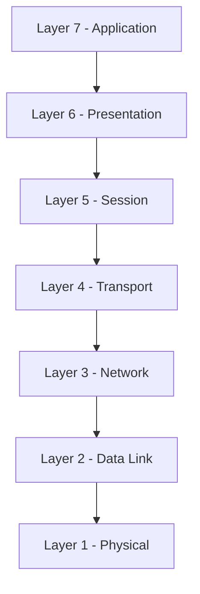

# OSI Model – Technical Overview for Cloud & Infrastructure Engineers

## 1. Introduction

The OSI (Open Systems Interconnection) Model, defined by ISO (ISO/IEC 7498-1), is a conceptual framework that standardizes network communication into seven abstraction layers.

Although modern networks implement the TCP/IP model in practice, the OSI model remains fundamental for:

- Cloud Architecture
- Network Engineering
- Cybersecurity
- Troubleshooting
- Certification exams (AWS, Azure, Cisco, CompTIA, etc.)

It provides a structured way to understand how data flows across distributed systems.

---

# 2. The 7 OSI Layers (Technical Breakdown)

## Layer 7 – Application

**Responsibility:**
Provides network services directly to end-user applications.

**Examples:**
- HTTP / HTTPS
- FTP / SFTP
- SMTP
- DNS
- SSH
- SNMP

**Cloud Example:**
Accessing an AWS API endpoint via HTTPS operates at Layer 7.

---

## Layer 6 – Presentation

**Responsibility:**
- Data encoding/decoding
- Encryption/Decryption
- Compression
- Serialization formats

**Examples:**
- TLS / SSL
- JSON / XML
- UTF-8 encoding
- Base64 encoding

**Cloud Example:**
TLS encryption between client and Application Load Balancer.

---

## Layer 5 – Session

**Responsibility:**
- Session establishment
- Session management
- Authentication session tracking
- Checkpointing

**Cloud Example:**
Maintaining authenticated sessions between client and cloud-hosted application.

---

## Layer 4 – Transport

**Responsibility:**
- End-to-end communication
- Reliability control
- Flow control
- Port multiplexing
- Segmentation and reassembly

**Protocols:**
- TCP
- UDP
- SCTP

**Cloud Example:**
HTTPS over TCP port 443; DNS over UDP port 53.

---

## Layer 3 – Network

**Responsibility:**
- Logical addressing
- Packet routing
- Path determination
- Fragmentation

**Protocols:**
- IPv4 / IPv6
- ICMP
- IPSec
- OSPF
- BGP

**Cloud Example:**
VPC route tables and BGP in hybrid cloud connectivity.

---

## Layer 2 – Data Link

**Responsibility:**
- MAC addressing
- Frame delivery within local network
- Error detection (CRC)
- VLAN tagging

**Technologies:**
- Ethernet (IEEE 802.3)
- ARP
- 802.1Q VLAN

**Cloud Example:**
Communication inside the same subnet in a VPC.

---

## Layer 1 – Physical

**Responsibility:**
- Bit transmission
- Electrical signaling
- Optical transmission
- Radio frequencies

**Examples:**
- UTP cables
- Fiber optics
- Wi-Fi frequencies

**Cloud Example:**
Data center fiber backbone infrastructure.

---

# 3. Visual Diagram

---

# 4. Encapsulation Process

When data is transmitted:

1. Data originates at Layer 7.
2. Each layer adds its own header (encapsulation).
3. Data is transmitted at Layer 1.
4. The receiving host decapsulates upward.

## HTTPS Example

| Layer | Action |
|-------|--------|
| 7 | HTTP request generated |
| 6 | TLS encryption applied |
| 5 | Session established |
| 4 | TCP segment created |
| 3 | IP packet routed |
| 2 | Ethernet frame created |
| 1 | Bits transmitted |

---

# 5. OSI vs TCP/IP

| OSI Layer | TCP/IP Equivalent |
|------------|-------------------|
| Application | Application |
| Presentation | Application |
| Session | Application |
| Transport | Transport |
| Network | Internet |
| Data Link | Network Access |
| Physical | Network Access |

---

# 6. Cloud Troubleshooting by Layer

| Layer | Example Issue |
|--------|--------------|
| 7 | 500 Internal Server Error |
| 6 | TLS handshake failure |
| 5 | Session timeout |
| 4 | Port blocked by Security Group |
| 3 | Incorrect routing table |
| 2 | ARP failure |
| 1 | Physical disconnection |

---

# Conclusion

The OSI model provides a structured abstraction for understanding network communication and remains essential knowledge for Cloud Engineers and Infrastructure Architects.
